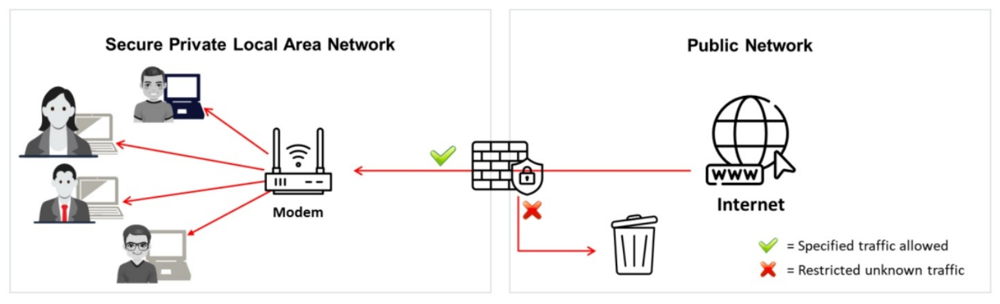
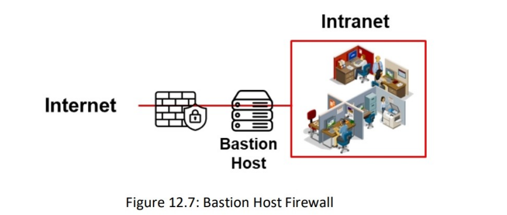
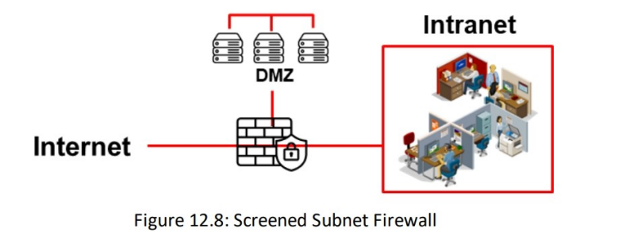
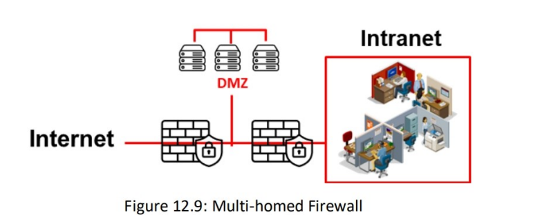
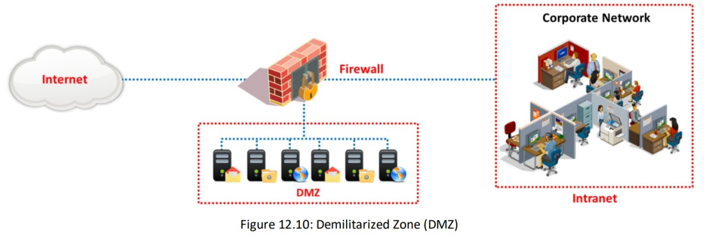

# Firewall

A firewall is a software- or hardware-based system located at the network gateway that protects the resources of a private network from unauthorized access by users on other networks. They are placed at the junction or gateway between two networks, usually a private network and a public network such as the Internet. Firewalls examine all the messages entering or leaving the intranet and block those that do not meet the specified security criteria. Firewalls may be concerned with the type of traffic or with the source or destination addresses and ports. They include a set of tools that monitor the flow of traffic between networks. A firewall placed at the network level and working closely with the router filters all the network packets to determine whether to forward them toward their destinations. Always install firewalls away from the rest of the network, so that none of the incoming requests can gain direct access to a private network resource. If appropriately configured, the firewall protects systems on one side of it from systems on the other side. 
- A firewall is an intrusion detection mechanism that is designed by an organization's security policy. Its settings can change to make appropriate changes to its functionality.
- Firewalls can be configured to restrict incoming traffic to POP and SMTP and to enable email access. Certain firewalls block specific email services to acoid spam.
- A firewall can be configured to check inbound traffic at a "checkpoint", where a security audit is performed. It can also act as an active "phone tap" tool for identifying an intruder's attemp to dial into modems in a secured network. Firewall logs consist of logging information that notifies the administrator about attempts to access various services.
- The firewall verifies the incoming and outgoing traffic against its rules and acts as a router to move data between networks. The firewall allows or denies access requests made from one side of it to services on the other side.
-  Identify all the attempts to log into the network for auditing. Unauthorized attempts can be identified by embedding an alarm that is triggered when an unauthorized user attempts to log in. Firewalls can filter packets based on the address and type of traffic. They recognize the source and destination addresses as well as port numbers during address filtering, and they identify the types of network traffic during protocol filtering. Firewalls can identify the state and attributes of data packets.

# Firewall Architecture
The firewall architecture consists of the following elements:
### **Bastion Host**
The bastion host is designed for defending the network against attacks. It acts as a mediator between inside and outside networks. A bastion host is a computer system designed and configured to protect network resources from attacks. Traffic entering or leaving the network passes through the firewall. It has two interfaces: 
- Public interface directly connected to the Internet 
- Private interface connected to the intranet 

### **Screend Subnet**
A screened subnet (DMZ) is a protected network created with a two- or three-homed firewall behind a screening firewall, and it is a term that is commonly used to refer to the DMZ. When using a three-homed firewall, connect the first interface to the Internet, the second to the DMZ, and the third to the intranet. The DMZ responds to public requests and has no hosts accessed by the private network. Internet users cannot access the private zone. 

The advantage of screening a subnet away from the intranet is that public requests can be responded to without allowing traffic into the intranet. A disadvantage of the three- homed firewall is that if it is compromised, both the DMZ and the intranet could also be compromised. A safer technique is to use multiple firewalls to separate the Internet from the DMZ, and to then separate the DMZ from the intranet.

### **Multi-homed Firewall**

A multi-homed firewall is a node with multiple NICs that connects to two or more networks. It connects each interface to separate network segments logically and physically. A multi-homed firewall helps in increasing the efficiency and reliability of an IP network. The multi-homed firewall has more than three interfaces that allow for further subdividing the systems based on the specific security objectives of the organization. However, the model that provides deeper protection is the back-to-back firewall.

## Demilitarized Zone (DMZ)
In computer networks, the demilitarized zone (DMZ) is an area that hosts computer(s) or a small sub-network placed as a neutral zone between a particular company's internal network and an untrusted external network to prevent outsider access to a company's private data. The DMZ serves as a buffer between the secure internal network and the insecure Internet, as it adds a layer of security to the corporate LAN, thus preventing direct access to other parts of the network. 

A DMZ is created using a firewall with three or more network interfaces that are assigned specific roles, such as an internal trusted network, a DMZ network, or an external untrusted network (Internet). Any service such as email, web, or FTP that provides access to external users can be placed in the DMZ. However, web servers that communicate with database servers cannot reside in the DMZ, as they could give outside users direct access to sensitive information. There are many ways in which the DMZ can be configured according to specific network topologies and company requirements.

# Types of Firewalls

