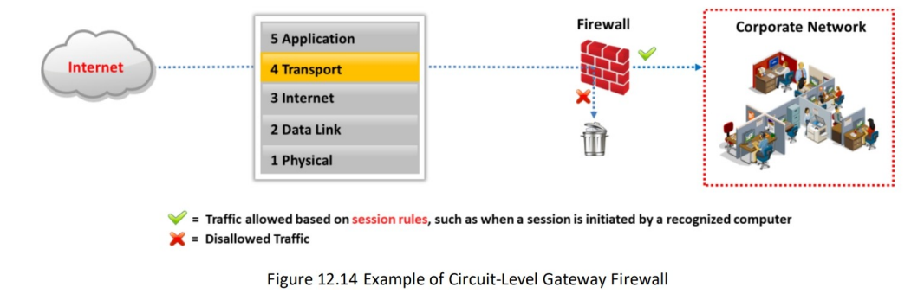

# Firewall

A firewall is a software- or hardware-based system located at the network gateway that protects the resources of a private network from unauthorized access by users on other networks. They are placed at the junction or gateway between two networks, usually a private network and a public network such as the Internet. Firewalls examine all the messages entering or leaving the intranet and block those that do not meet the specified security criteria. Firewalls may be concerned with the type of traffic or with the source or destination addresses and ports. They include a set of tools that monitor the flow of traffic between networks. A firewall placed at the network level and working closely with the router filters all the network packets to determine whether to forward them toward their destinations. Always install firewalls away from the rest of the network, so that none of the incoming requests can gain direct access to a private network resource. If appropriately configured, the firewall protects systems on one side of it from systems on the other side. 
- A firewall is an intrusion detection mechanism that is designed by an organization's security policy. Its settings can change to make appropriate changes to its functionality.
- Firewalls can be configured to restrict incoming traffic to POP and SMTP and to enable email access. Certain firewalls block specific email services to acoid spam.
- A firewall can be configured to check inbound traffic at a "checkpoint", where a security audit is performed. It can also act as an active "phone tap" tool for identifying an intruder's attemp to dial into modems in a secured network. Firewall logs consist of logging information that notifies the administrator about attempts to access various services.
- The firewall verifies the incoming and outgoing traffic against its rules and acts as a router to move data between networks. The firewall allows or denies access requests made from one side of it to services on the other side.
-  Identify all the attempts to log into the network for auditing. Unauthorized attempts can be identified by embedding an alarm that is triggered when an unauthorized user attempts to log in. Firewalls can filter packets based on the address and type of traffic. They recognize the source and destination addresses as well as port numbers during address filtering, and they identify the types of network traffic during protocol filtering. Firewalls can identify the state and attributes of data packets.

# Firewall Architecture
The firewall architecture consists of the following elements:
### **Bastion Host**
The bastion host is designed for defending the network against attacks. It acts as a mediator between inside and outside networks. A bastion host is a computer system designed and configured to protect network resources from attacks. Traffic entering or leaving the network passes through the firewall. It has two interfaces: 
- Public interface directly connected to the Internet 
- Private interface connected to the intranet 

### **Screend Subnet**
A screened subnet (DMZ) is a protected network created with a two- or three-homed firewall behind a screening firewall, and it is a term that is commonly used to refer to the DMZ. When using a three-homed firewall, connect the first interface to the Internet, the second to the DMZ, and the third to the intranet. The DMZ responds to public requests and has no hosts accessed by the private network. Internet users cannot access the private zone. 

The advantage of screening a subnet away from the intranet is that public requests can be responded to without allowing traffic into the intranet. A disadvantage of the three- homed firewall is that if it is compromised, both the DMZ and the intranet could also be compromised. A safer technique is to use multiple firewalls to separate the Internet from the DMZ, and to then separate the DMZ from the intranet.

### **Multi-homed Firewall**

A multi-homed firewall is a node with multiple NICs that connects to two or more networks. It connects each interface to separate network segments logically and physically. A multi-homed firewall helps in increasing the efficiency and reliability of an IP network. The multi-homed firewall has more than three interfaces that allow for further subdividing the systems based on the specific security objectives of the organization. However, the model that provides deeper protection is the back-to-back firewall.

## Demilitarized Zone (DMZ)
In computer networks, the demilitarized zone (DMZ) is an area that hosts computer(s) or a small sub-network placed as a neutral zone between a particular company's internal network and an untrusted external network to prevent outsider access to a company's private data. The DMZ serves as a buffer between the secure internal network and the insecure Internet, as it adds a layer of security to the corporate LAN, thus preventing direct access to other parts of the network. 

A DMZ is created using a firewall with three or more network interfaces that are assigned specific roles, such as an internal trusted network, a DMZ network, or an external untrusted network (Internet). Any service such as email, web, or FTP that provides access to external users can be placed in the DMZ. However, web servers that communicate with database servers cannot reside in the DMZ, as they could give outside users direct access to sensitive information. There are many ways in which the DMZ can be configured according to specific network topologies and company requirements.

# Types of Firewalls
### 📌 **Based on Configuration**

| Firewall Type              | Description |
|---------------------------|-------------|
| **Network-based Firewalls** | Placed at the **network perimeter** to inspect packet headers and enforce security rules, protecting the local area network by determining whether to forward or drop packets. |
| **Host-based Firewalls**   | Act as **software-based traffic filters** installed on individual **PCs or servers**, providing security against unauthorized access, Trojans, and email worms. |

---

### 📌 **Based on Working Mechanism**

| Firewall Type                         | Description |
|--------------------------------------|-------------|
| **Packet Filtering Firewall**        | Compares each packet against **predefined criteria** such as source and destination IP addresses, port numbers, and protocols to decide whether to drop or transmit the message. |
| **Circuit-Level Gateway Firewall**   | Operates at the **session layer** of the OSI model, allowing traffic to pass through the gateway while **blocking direct incoming packets**. |
| **Application-Level Firewall**       | Operates at the **application layer**, filtering traffic based on specific **application protocols**, allowing only supported services and blocking others to prevent unauthorized access. |
| **Stateful Multilayer Inspection Firewall** | Combines packet filtering, circuit-level gateways, and application-level inspection. Evaluates both **network layer session legitimacy** and **application layer packet contents**. |
| **Application Proxy**                | Works as an **interface between user workstations and the Internet**, **filtering connections** based on specific services/protocols (e.g., allowing only FTP traffic via an FTP proxy). |
| **Virtual Private Network (VPN) Firewall** | Enhances security by **encrypting data** and managing traffic flow between **VPN endpoints**, ensuring only **authorized traffic** passes through the VPN tunnel while enforcing firewall rules. |

There are two types of firewalls, each developed with specific features and capabilities that consider different network environments and security needs. Understanding these categories is essential for implementing effective firewall technologies to secure networks.

### 📌 **Type of Based on Configuration**
#### **Network-based Firewalls**

A network-based firewall is a dedicated firewall device placed on the perimeter of the network. It is an integral part of the network setup and is also built into broadband routers or used as a standalone product. It employs the technique of packet filtering. It reads the header of a packet to find out the source and destination addresses, and compares them with a set of predefined and/or user-created rules that determine whether it should forward or drop the packet. This firewall functions on an individual system or a particular network connected using a single interface. Examples of network- based firewalls include Cisco ASA and FortiGate. These firewalls are designed to protect the private local area network. 

However, network-based firewalls are expensive as well as difficult to implement and upgrade.

**Advantages:**
- Security: A network-based firewall with its operating system (OS) is considered to reduce security risks and increase the level of security controls.
- Speed: network-based firewalls initiate faster responses and enable more traffic.
- Minimal Interference: Since a network-based firewall is a separate network component, it enables better management and allows the firewall to shut down, move, or be reconfigured without much interference in the network.

**Disadvantages**
- More expensive than a host-based firewall.
- Difficult to implement and configure.
- Consumes more space and involves cabling.

#### **Host-based Firewalls**
A host-based firewall is similar to a filter. It sits between a regular application and the networking components of the OS. It is more useful for individual home users and it is suitable for mobile users who need digital security when working outside the corporate network. Further, it is easy to install on an individual's PC, notebook, or workgroup server. It helps protect your system from outside attempts at unauthorized access and provides protection against everyday Trojans and email worms. It includes privacy controls, web filtering, and more. A host-based firewall implants itself in the critical area of the application/network path. It analyzes the data flow against the rule set. 

The configuration of a host-based firewall is simple compared to that of a network- based firewall. A host-based firewall intercepts all requests from a network to the computer to determine if they are valid and protects the computer from attacks and unauthorized access. It incorporates user-defined controls, privacy controls, web filtering, content filtering, etc., to restrict unsafe applications from running on an individual system. Host-based firewalls use more resources than network-based firewalls, which reduces the speed of the system. Examples of host-based firewalls include those produced by Norton, McAfee, and Kaspersky.

**Advantages:**
- Lessexpensive than network-based firewalls.
- Ideal for personal or home use.
- Easier to configure and reconfigure.

**Disadvantages:**
- Consumes system resources.
- Difficult to uninstall.
- Not appropriate for environments requiring faster responses times.

### 📌 **Type of Based on Working Mechanism**

There are different types of firewall technologies depending on where the communication is taking place, where the traffic is intercepted in the network, the state that is traced, and so on. Considering the capabilities of different firewalls, it is easy to choose and place an appropriate firewall to meet the security requirements in the best possible way. Each type of firewall has its advantages. 

Several firewall technologies are available for organizations to implement their security measures. Sometimes, firewall technologies are combined with other technologies to build another firewall technology. For example, NAT is a routing technology; however, when it is combined with a firewall, it is considered a firewall technology. 

The various firewall technologies are listed below:
- Packet Filtering
- Circuit-Level Gateways
- Application-Level Firewall
- Stateful Multilayer Inspection
- Application Proxies
- Network Address Translation
- Virtual Private Network

The table below summarizes technologies operating at each OSI layer:

| **OSI Layer**   | **Firewall Technology**                                         |
|----------------|------------------------------------------------------------------|
| Application     | - Virtual Private Network (VPN)    - Application Proxies     |
| Presentation    | - Virtual Private Network (VPN)                                 |
| Session         | - Virtual Private Network (VPN)    - Circuit-Level Gateways  |
| Transport       | - Virtual Private Network (VPN)    - Packet Filtering        |
| Network         | - Virtual Private Network (VPN)    - Network Address Translation (NAT)   - Packet Filtering   - Stateful Multilayer Inspection |
| Data Link       | - Virtual Private Network (VPN)    - Packet Filtering        |
| Physical        | - Not Applicable                                                |

The security levels of these technologies vary according to their efficiency levels. A comparison of these technologies can be made by allowing them to pass through the OSI layer between the hosts. The data passes through the intermediate layers from a higher layer to a lower layer. Each layer adds additional information to the data packets. The lower layer now sends the obtained information through the physical network to the upper layers and then to its destination.

#### **Packet Filtering Firewall**

In a packet filtering firewall, each packet is compared with a set of criteria before it is forwarded. Depending on the packet and the criteria, the firewall can drop the packet and transmit it or send a message to the originator. The rules can include the source and the destination IP address, the source and the destination port number, and the protocol used. It works at the internet layer of the TCP/IP model or the network layer of the OSI model. Packet filtering firewalls focus on individual packets, analyze their header information, and determine which way they need to be directed. Traditional packet filters make this decision according to the following information in a packet: 
- **Source IP address**: Used to check whether the packet is coming from a valid source. The information about the source IP address can found from the IP header of the packet. 
- **Destination IP address**: Checks if the packet is going to the correct destination and if the destination accepts these types of packets. The information about the destination IP address can found from the IP header of the packet.
- **Source TCP/UDP port**: Used to check the source port of the packet.
- **Destination TCP/UDP port**: Used to monitor the destination port regarding the services to be allowed and the services to be denied.
- **TCP flag bits**: Used to check whether the packet has SYN, ACK, or other bits set for the connection to be made.
- **Protocol in use**: Used to check whether the protocol that the packet is carrying should be allowed.
- **Direction**: Used to check whether the packet is entering or leaving the private network.
- **Interface**: Used to check whether the packet is coming from an unreliable zone.

#### **Circuit-Level Gateway Firewall**

A circuit-level gateway firewall works at the session layer of the OSI model or transport layer of TCP/IP. It forwards data between networks without verification and blocks incoming packets from the host but allows the traffic to pass through itself. Information passed to remote computers through a circuit-level gateway will appear to have originated from the gateway, as the incoming traffic carries the IP address of the proxy (circuit-level gateway). Such firewalls monitor requests to create sessions and determine if those sessions will be allowed. 

A circuit-level gateway gives controlled access to network services and host requests. To determine whether a requested session is valid, it checks the TCP handshake between packets. Circuit proxy firewalls allow or prevent data streams; they do not filter individual packets. They are relatively inexpensive and hide the information about the private network that they protect.

#### **Application-Level Firewall**

Application-based proxy firewalls focus on the application layer rather than just the packets. Application-level gateways (proxies) can filter packets at the application layer of the OSI model (or the application layer of TCP/IP). Incoming and outgoing traffic is restricted to services supported by the proxy; all other service requests are denied. The need for an application-level firewall arises from the tremendous amount of voice, video, and collaborative traffic in the data-link layer and network layer, which may be used for unauthorized access to internal and external networks. Application-level gateways configured as web proxies prohibit FTP, gopher, telnet, or other traffic. They examine traffic and filter application-specific commands such as HTTP: post and get. 

Traditional firewalls are unable to filter such types of traffic. They can inspect, find, and verify malicious traffic that is missed by stateful inspection firewalls to make decisions as to whether to allow access, and they improve the overall security of the application layer. For example, worms that send malicious code in legitimate protocols cannot be detected by stateful firewalls, as proxy firewalls focus on packet headers in the network layer. However, deep packet inspection firewalls can find such attacks with the help of informative signatures added inside packets. 

**Some of the features of application-level firewalls are as follows:** 
- They analyze the application information to make decisions as to whether to permit traffic. 
- Being proxy-based, they can permit or deny traffic according to the authenticity of the user or process involved. 
- A content-caching proxy optimizes performance by caching frequently accessed information rather than sending new requests to the servers for the same old data. 

Application-layer firewalls can function in one of two modes: active or passive. 
- **Active application-level firewalls**: They examine all incoming requests, including the actual message that is exchanged, against known vulnerabilities, such as SQL injection, parameter and cookie tampering, and cross-site scripting. The requests that are deemed genuine are allowed to pass through them. 
- **Passive application-level firewalls**: They work similarly to IDS in that they also check all incoming requests against known vulnerabilities, but they do not actively reject or deny those requests if a potential attack is discovered.

#### **Stateful Multilayer Inspection Firewall**

Stateful multilayer inspection firewalls combine the aspects of the three above-mentioned types of firewalls (packet filtering, circuit-level gateways, and application-level firewalls). They filter packets at the network layer of the OSI model (or the internet layer of the TCP/IP model) to determine whether session packets are legitimate, and they evaluate the contents of the packets at the application layer. 

Using stateful packet filtering, you can overcome the limitation of packet firewalls, which can only filter the IP address, port, protocol, and so on. This multilayer firewall can perform deep packet inspection. 

**Features of the Stateful Multilayer Inspection Firewall:** 
- This type of firewall can remember the packets that passed through it earlier and make decisions about future packets accordingly. 
- These firewalls combine the best features of both packet filtering and application-based filtering. 
- Cisco PIX firewalls are stateful. 
- These firewalls track and log slots or translations.\

#### **Application Proxy**

An application-level proxy works as a proxy server and filters connections for specific services. It filters connections based on the services and protocols when acting as a proxy. For example, an FTP proxy will only allow FTP traffic to pass through while all other services and protocols will be blocked. It is a type of server that acts as an interface between the user workstation and the Internet. It correlates with the gateway server and separates the enterprise network from the Internet. It receives a request from a user to provide the Internet service and responds to the original request only. A proxy service is an application or program that helps forward user requests (for example, FTP or Telnet) to the actual services. A proxy is also known as an application-level gateway, as it renews the connections and act as a gateway to the services. Proxies run on a firewall host that is either a dual-homed host or some other bastion host for security purposes. Some proxies, namely caching proxies, improve network efficiency. They keep copies of the requested data of the hosts that they proxy. Such proxies can provide the data directly when multiple hosts request the same data. Caching proxies help in reducing the load on network connections, whereas proxy servers provide both security and caching. 

A proxy service is available to the user in the internal network and the service in the outside network (Internet), and it is transparent. Instead of direct communication, it talks with the proxy and it handles all the communication between users and Internet services. Transparency is the main advantage of proxy services. To the user, a proxy server presents an illusion that it is dealing directly with the real server, whereas to a real server, the proxy server gives the illusion that it is dealing directly with the user. 

**Advantages** 
- Proxy services are useful for logging because they can understand application protocols and effectively allow logging. 
- Proxy services reduce the load on network links as they are capable of caching copies of frequently requested data and allow it to be directly loaded from the system instead of the network. 
- Proxy systems perform user-level authentication, as they are involved in the connection. 
- Proxy systems automatically protect weak or faulty IP implementations as they sit between the client and the Internet and generate new IP packets for the client. 

**Disadvantages**
- Proxy services lag behind non-proxy services until suitable proxy software is available. " 
- Each service in a proxy may use different servers. 
- Proxy services may require changes in the client, applications, and procedures.

#### Network Address Translation (NAT)

Network address translation (NAT) separates IP addresses into two sets and enables the LAN to use these addresses for internal and external traffic. The NAT helps hide an internal network layout and force connections to go through a choke point. It also works with a router, and similarly to packet filtering, it will also modify the packets that the router sends simultaneously. When the internal machine forwards the packet to the external machine, the NAT modifies the source address of the packet to make it appear as if it is coming from a valid address. When the external machine sends the packet to the internal machine, the NAT modifies the destination address to turn the visible address into the correct internal address. The NAT can also change the source and destination port numbers. It limits the number of public IP addresses that an organization can use. It can act as a firewall filtering technique whereby it allows only those connections that originate in the internal network and blocks the connections that originate in the external network. 

NAT systems use different schemes for translation between internal and external addresses: 
- Assign one external host address for each internal address and always apply the same translation. This slows down connections and does not provide any savings in address space. 
- Dynamically allocate an external host address without modifying the port numbers when the internal host initiates a connection. This restricts the number of internal hosts that can simultaneously access the Internet to the number of available external addresses. 
- Create a fixed mapping from internal addresses to externally visible addresses but use a port mapping so that multiple internal machines use the same external address. 
- Dynamically allocate an external host address and port pair each time an internal host initiates a connection. This makes the most efficient possible use of the external host addresses. 

**Advantages** 
- Network address translation helps to enforce the firewall's control over outbound connections. 
- It restricts incoming traffic and allows only packets that are part of a current interaction initiated from the inside. 
- It helps hide the internal network's configuration and thus lowers the success rate of attacks on the network or system. 
  
**Disadvantages**

- The NAT system has to guess how long it should keep a particular translation, which is not always possible. 
- The NAT interferes with encryption and authentication systems to ensure the security of the data. 
- Dynamic allocation of ports may interfere with packet filtering.

#### Virtual Private Network (VPN) Firewall

A virtual private network (VPN) is a network that provides secure access to the private network through the Internet. VPNs are used for connecting wide area networks (WAN). They allow computers on one network to connect to computers on another network. They are used for the secure transmission of sensitive information over an untrusted network via encapsulation and encryption. They employ encryption and integrity protection, enabling you to use a public network as a private network. A VPN performs encryption and decryption outside the packet- filtering perimeter to allow the inspection of packets coming from other sites. It establishes a virtual point-to-point connection through the use of dedicated connections. A VPN also encapsulates packets sent over the Internet. It combines the advantages of both public and private networks. VPNs have no relation to firewall technology, but firewalls are convenient for adding VPN features as they help in providing secure remote services. The computing device running the VPN software can only access the VPN. VPN firewalls enhance security by encrypting data and managing traffic flow between VPN endpoints, ensuring only authorized traffic passes through the VPN tunnel while applying firewall rules to prevent unauthorized access. 

All VPNs that run over the Internet adopt the following principles: 
- Encrypts the traffic 
- Checks for integrity protection 
- Encapsulates new packets, which are sent across the Internet to some destination that reverses the encapsulation 
- Checks the integrity 
- Decrypts the traffic eventually 
- 
**Advantages**

- A VPN hides all the traffic that flows over it, ensures encryption, and protects data from snooping. 
- It provides remote access for protocols while avoiding attackers from the Internet at large. 
  
**Disadvantages**

- As the VPN runs on a public network, the user will be vulnerable to an attack on the destination network.

#### Next-Generation Firewall (NGFW)

Next-generation firewalls (NGFWs) are sophisticated network security solutions that perform functions of traditional firewalls. They incorporate advanced features such as deep packet inspection, application awareness, control, integrated intrusion prevention systems (IPS), and cloud-based threat intelligence. These capabilities enable NGFWs to address dynamic threat landscapes effectively and offer enhanced protection to contemporary networks.

NGFWs operate by examining the network traffic at various layers of the OSI model. This multilayer inspection allows them to detect and block complex threats. They scrutinize packet payloads, monitor applications, and identify unusual traffic patterns. By consolidating multiple security functions into a single platform, NGFWs can provide centralized management and more efficient security operations. 

**Advantages** 
- NGFWs offer integrated security features, such as IPS, antimalware, and content filtering, providing robust protection against a wide range of threats. 
- NGFWs provide detailed visibility of the network traffic, user activity, and application behavior, allowing better monitoring and threat detection. 
- By leveraging threat intelligence and advanced security technologies, NGFWs can detect and block sophisticated attacks such as zero-day exploits, ransomware, and advanced persistent threats (APTs). 

**Disadvantages** 
- NGFWs can be more expensive than traditional firewalls, owing to their advanced features and capabilities. The initial investment and ongoing maintenance costs are significant. 
- The advanced features and capabilities of NGFWs render them more complex to configure and manage. 
- The deep packet inspection and advanced security functions of NGFWs can introduce latency. 

**Firewall Limitations** 

Although firewalls are essential to your security strategy, they have the following limitations: 
- Firewalls can restrict users from accessing valuable services such as FTP, Telnet, NIS, etc., and they sometimes restrict Internet access as well. 
- The firewall cannot prevent internal attacks (backdoor) in a network, e.g., a disgruntled employee who cooperates with the external attacker. 
- The firewall focuses its security at a single point, which makes other systems within the network prone to security attacks. 
- A bottleneck could occur if all the connections pass through the firewall. 
- The firewall cannot protect the network from social engineering and data-driven attacks whereby the attacker sends malicious links and emails to employees inside the network. 
- If external devices such as laptops, mobile phones, portable hard drives, etc., are already infected and connected to the network, then a firewall cannot protect the network from these devices. 
- The firewall is unable to adequately protect the network from all types of zero-day viruses that try to bypass it.
- A firewall cannot do anything if the network design and configuration is faulty.
- A firewall is not an alternative to antivirus or antimalware tools.
- A firewall does not block attacks from a higher level of the protocol stack.
- A firewall does not prevent attacks originating from common ports and applications.
- A firewall does not prevent attacks from dial-in connections.
- A firewall is unable to understand tunneled traffic.